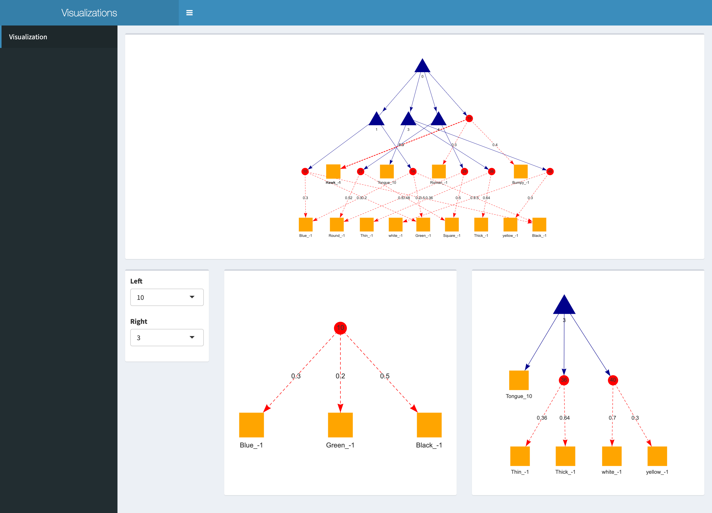

# AOG(And-Or-Grammar) Visualizer
This is a tree structure visualization tool developed with Shiny and VisNetwork(https://datastorm-open.github.io/visNetwork/) for AOG structure. Take a glimpse:

Code can be adapted to fit different needs. A sample visualization is hosted on Shinyapps.io: https://surcat.shinyapps.io/visualization_summary/

## Instructions
Install Homebrew if needed
`ruby -e "$(curl -fsSL https://raw.githubusercontent.com/Homebrew/install/master/install)"`

Install R to be able to run the script
`brew install r`

Install Pandoc
`brew install pandoc`

### To run the Rscript, use:
`Rscript PATH/Visualize.R VISUALIZE_FILE.txt`

Then copy the http address to your browser to display the visualization.

### Input Format:
FROM, TO, SOURCE_CONTENT, CHILD_CONTENT, WEIGHT, ORDER, LEVEL
